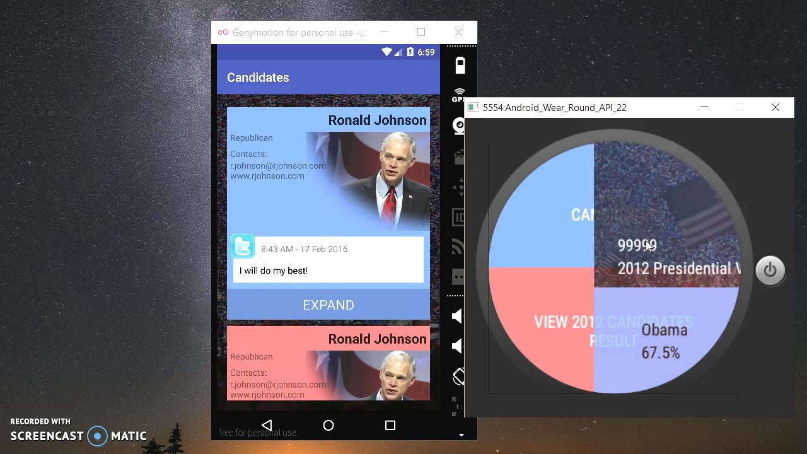
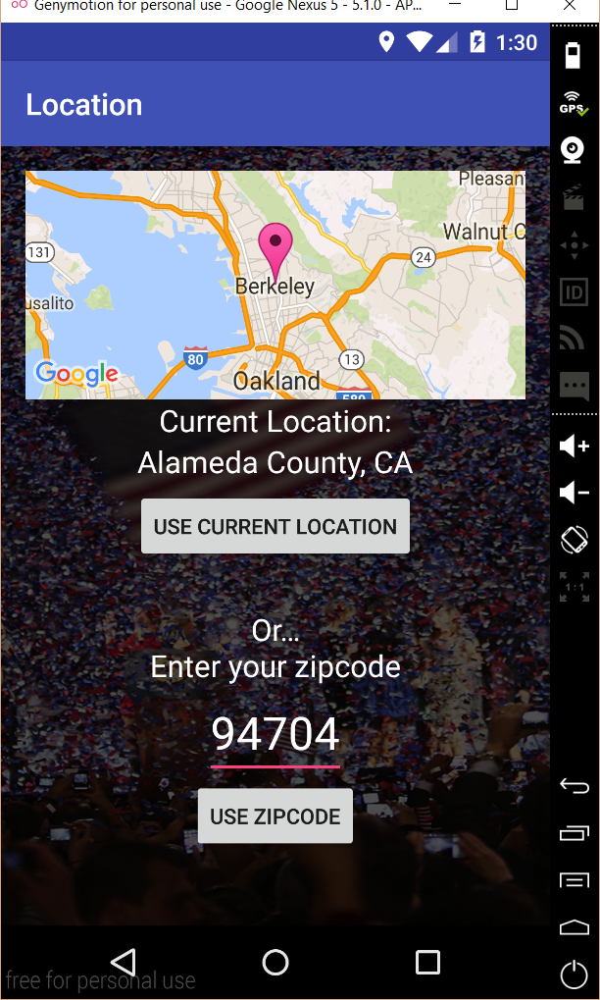
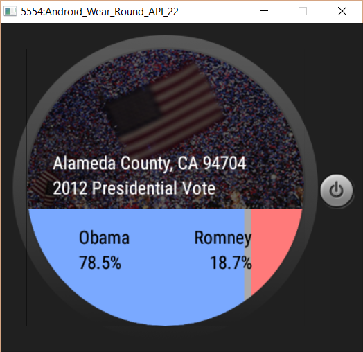

# PROG 02: Represent!
Final version of Represent! application. Implemented phone-to-watch, watch-to-phone connection, sensors, map api, and RESTful api features.

## Authors

Ho Jeff Lee ([jlee257@berkeley.edu](mailto:jlee257@berkeley.edu))

## Demo Video

Watch [PROG02-B election] (https://youtu.be/A8c9bfCzLxU)

Watch [PROG02-C Represent!] (https://youtu.be/iDOvd0Y_bjw)

## Screenshots

